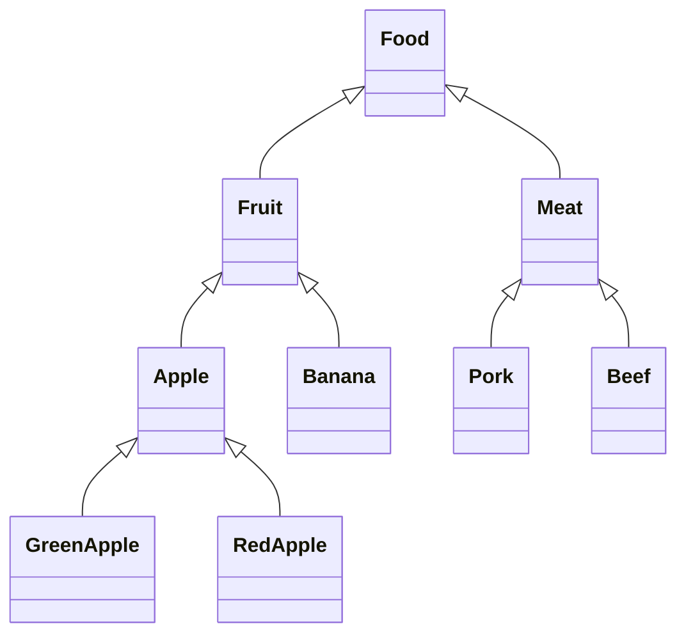
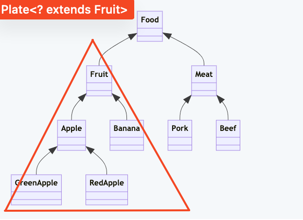
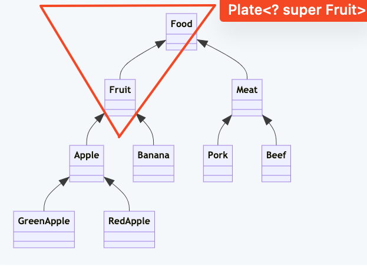

# 泛型边界

1. 类图



2. 代码

```java
import java.util.Arrays;
import java.util.List;

// lv1
class Food {
}

// lv2
class Fruit extends Food {
}

class Meat extends Food {
}

// lv3
class Apple extends Fruit {
}

class Banana extends Fruit {
}

class Pork extends Meat {
}

class Beef extends Meat {
}

// lv4
class GreenApple extends Apple {
}

class RedApple extends Apple {
}

// 盘子
class Plate<T> {
    private T item;

    public Plate(T t) {
        item = t;
    }

    public T get() {
        return item;
    } //取东西

    public void set(T t) {
        item = t;
    } //放东西
}

class Scratch {
    public static void main(String[] args) {
        // 准备盘子阶段：四种盘子
        Plate<Food> foodPlate = new Plate<Food>(new Food());
        Plate<Fruit> fruitPlate = new Plate<Fruit>(new Fruit());
        Plate<Apple> applePlate = new Plate<Apple>(new Apple());
        Plate<GreenApple> greenApplePlate = new Plate<GreenApple>(new GreenApple());

        // 第一阶段：'装苹果的盘子' not-is-a '装水果的盘子'
        Plate<Fruit> fPlate1 = null;
        //fPlate1 = foodPlate; // 报错，编译器不允许此操作
        fPlate1 = fruitPlate;
        //fPlate1 = applePlate; // 报错，编译器不允许此操作
        //fPlate1 = greenApplePlate; // 报错，编译器不允许此操作
        // why? 容器里的Fruit,Apple对象有'继承关系'不代表装对象的容器Plate<Fruit>,Plate<Apple>有'继承关系'，所以不可以把 Plate<Apple>的引用传递给 Plate<Fruit>

        // 第二阶段：使用<? extends Fruit> 上界通配符，'一个能放水果以及一切是水果派生类的盘子' = '啥水果都能放的盘子'
        Plate<? extends Fruit> fPlate2 = null;
        //fPlate2 = foodPlate; // 报错，编译器不允许此操作
        fPlate2 = fruitPlate;
        fPlate2 = applePlate;
        fPlate2 = greenApplePlate;
        // why? 这里 Plate<? extends Fruit> 是 Plate<Fruit>,Plate<Apple>,Plate<GreenApple> 的基类，'放苹果的盘子'的引用当然能赋值给基类'啥水果都能放的盘子'

        // 第三阶段：使用<? super Fruit> 下界通配符，'一个能放水果以及一切是水果基类的盘子'
        Plate<? super Fruit> fPlate3 = null;
        fPlate3 = foodPlate;
        fPlate3 = fruitPlate;
        //fPlate3 = applePlate; // 报错，编译器不允许此操作
        //fPlate3 = greenApplePlate; // 报错，编译器不允许此操作
        // why? 这里 Plate<? super Fruit> 是 Plate<Fruit>,Plate<Food>的基类，但不是 Plate<Apple> 的基类

        // 第四阶段：边界的副作用，side-effects

        // 上界<? extends T> 不能往里存，只能往外取
        //fPlate2.set(new Food()); // 报错
        //fPlate2.set(new Fruit()); // 报错
        //fPlate2.set(new Apple()); // 报错
        //fPlate2.set(new GreenApple()); // 报错
        Object o1 = fPlate2.get();
        Food o2 = fPlate2.get();
        Fruit o3 = fPlate2.get();
        Apple o4 = (Apple) fPlate2.get(); // 在运行时，可能会出现强制类型转化错误
        // why? 编译器在Plate<Apple>赋值后，标上了一个占位符CAP#1，无论后面怎么插入新对象Apple,Fruit,Food，都会与这个CAP#1不匹配，因此不允许此操作。

        // 下界<? super T> 可以往里存，往外取只能放在Object对象里
        //fPlate3.set(new Food()); // 报错
        fPlate3.set(new Fruit());
        fPlate3.set(new Apple());
        fPlate3.set(new GreenApple());
        Object o5 = fPlate3.get();
        Food o6 = (Food) fPlate3.get(); // 在运行时，可能会出现强制类型转化错误
        Fruit o7 = (Fruit) fPlate3.get(); // 在运行时，可能会出现强制类型转化错误
        Apple o8 = (Apple) fPlate3.get(); // 在运行时，可能会出现强制类型转化错误
        GreenApple o9 = (GreenApple) fPlate3.get(); // 在运行时，可能会出现强制类型转化错误
        // why? 下界规定了存放元素的最小粒度的下限，插入对象只要是Fruit或比Fruit类粒度小(例如：派生类)都被允许的。

        // 总结阶段
        // 出于安全不犯错的前提，我们来理解 PECS （Producer Extends Consumer Super）
        // 怎样才能最低限度的不犯错误呢？
        // 使用上界通配符 Producer<? extends T> 首先限定了 Producer类内部"生产"的对象类型都是 T以及T的派生类，而后在Producer类"取出"这些对象并赋值给T以及T的基类对象是安全的。你可以强制类型转化，但这样往往是不安全的。
        // 使用下界通配符 Consumer<? super T> 首先限定了 Consumer类内部"接收"的对象类型都是 T以及T的基类，而后在Consumer类"放入"一些 T以及T的派生类型的对象并赋值给Consumer类内部 T以及T的基类型的对象是安全的。
    }
}

```

3. 上界通配符 Plate<? extends Fruit> 限定的元素类型区域如下图


4. 下界通配符 Plate<? super Fruit> 限定的元素类型区域如下图


# 参考

- [onJava8中文版#泛型-边界](https://github.com/prettykernel/OnJava8/blob/main/20-Generics.md#%E8%BE%B9%E7%95%8C)
- [Java 泛型 <? super T> 中 super 怎么 理解？与 extends 有何不同？](https://www.zhihu.com/question/20400700)