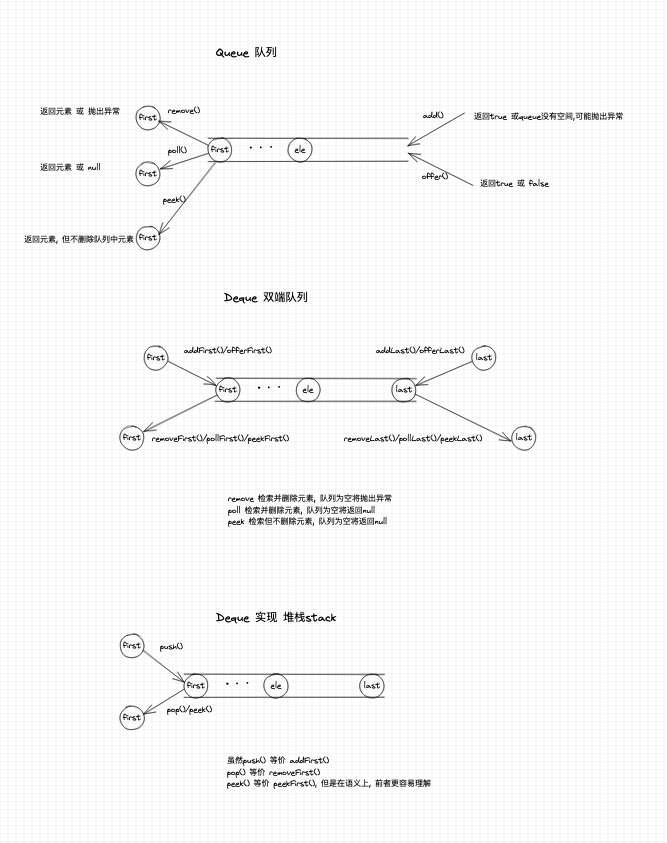

# 集合

## 使用泛型类型安全的集合

使用 Java 5 之前的集合的一个主要问题是编译器允许你向集合中插入不正确的类型。

要定义一个用于保存 Apple 对象的 ArrayList ，只需要使用 ArrayList<Apple> 来代替 ArrayList 。尖括号括起来的是类型参数（可能会有多个），它指定了这个集合实例可以保存的类型。
通过使用泛型，就可以在编译期防止将错误类型的对象放置到集合中。

## 链表 LinkedList

linkedlist 是list 和 deque 接口的双向链表实现。实现所有可选列表操作，并允许所有元素（包括null）。注意，实现是不同步的。

常用操作：

- 实现 list 的操作
    - add(int index, E e); 在此列表中的指定位置插入指定元素。将当前位于该位置的元素（如果有）和任何后续元素向右移动（将其索引加一）。
    - remove(int index); 移除此列表中指定位置的元素。将任何后续元素向左移动（从它们的索引中减去 1）。返回从列表中删除的元素。
- 实现 deque 的操作
    - addFirst(E e); //在此列表的开头插入指定元素。
    - offerFirst(E e); //在此双端队列的前面插入指定元素，除非它违反容量限制。当使用容量受限的双端队列时，此方法通常优于addFirst方法，后者仅通过抛出异常可能无法插入元素
    - addLast(E e);
    - offerLast(E e);
    - removeFirst(); //从此列表中删除并返回第一个元素
    - pollFirst(); //检索并删除此列表的第一个元素，如果此列表为空，则返回null 。
    - removeLast();
    - pollLast();
    - peekFirst(); //检索但不删除此列表的第一个元素，如果此列表为空，则返回null 。
    - peekLast(); //检索但不删除此列表的最后一个元素，如果此列表为空，则返回null 。
- 实现 deque 的队列queue操作
    - add(E e); // 等价 addLast() 将指定元素附加到此列表的末尾。
    - offer(E e); // 等价 offerLast()
    - remove(Object o); // 等价 removeFirst() 从此列表中删除第一次出现的指定元素（如果存在）。
    - poll(); // 等价 pollFirst()
    - element(); // 等价 getFirst()
    - peek(); // 等价 peekFirst()
- 实现 deque 的堆栈stack操作
    - push(E e); // addFirst()
    - pop(); // removeFirst()
    - peek(); // peekFirst()

Deque 支持两端元素插入和移除的线性集合。名称deque是“双端队列”的缩写，通常发音为“deck”。大多数Deque实现对它们可能包含的元素数量没有固定限制，但该接口支持容量受限的双端队列以及没有固定大小限制的双端队列。
该接口定义了访问双端队列两端元素的方法。提供了插入、删除和检查元素的方法。这些方法中的每一个都以两种形式存在：一种在操作失败时抛出异常，另一种返回一个特殊值（ null或false ，取决于操作）。后一种形式的插入操作是专门为容量受限的Deque实现而设计的；在大多数实现中，插入操作不会失败。
下表总结了上述十二种方法： 

Deque 方法总结

|     | 第一个元素 ( 头部 )  |              | 第一个元素 ( 头部 ) |              |
|-----|---------------|--------------|--------------|--------------|
|     | 抛出异常          | 特殊值          | 抛出异常         | 特殊值          |
| 插入  | addFirst(e)   | offerFirst() | addLast(e)   | offerLast(e) |
| 消除  | removeFirst() | pollFirst()  | removeLast() | pollLast()   |
| 检查  | getFirst()    | peekFirst()  | getLast()    | peekLast()   |

